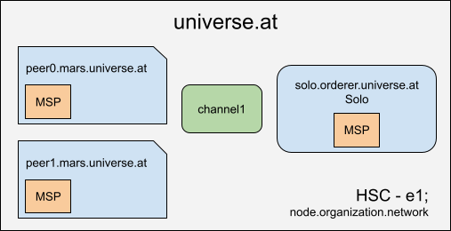

# Example 01 - one org network
## ToDos
- explanations regarding setup
- explanations regarding requirements
- explanations how to generate the artifacts
- install chaincode
- do some queries



The following fabric network characteristics should be built:

- a single organization, done
- two peers, done
- one cli, done
- solo as ordering service, done
- one channel
- predefined sacc chaincode
- without TLS

## Overview - important steps
1. Create crypto materials
2. Start the network
3. Create channel and join peers
4. Install chaincode
5. Do some queries

> Note that this network does not store persistent data. The ledger data is deleted each time the network is stopped or restarted, since the ledger and the state DB are stored in the peer container and are not linked to the host.

## Steps to start the network

```bash
# create the network artifacts
./generateArtifacts.sh

# open terminal 1 - start the network
docker-compose up

# start the network in the background
docker-compose up -d 

# open terminal 2 - check if the network is running
docker-compose ps

          Name                 Command       State                       Ports
---------------------------------------------------------------------------------------------------
cli                        /bin/bash         Up
peer0.mars.universe.at     peer node start   Up      0.0.0.0:7051->7051/tcp, 0.0.0.0:7053->7053/tcp
peer1.mars.universe.at     peer node start   Up      0.0.0.0:8051->7051/tcp, 0.0.0.0:8053->7053/tcp
solo.orderer.universe.at   orderer           Up      0.0.0.0:7050->7050/tcp


# stop the network
docker-compose down

# use the cli container to switch into peer0
docker exec -it cli bash

root@e8e6b4d93749:/opt/gopath/src/github.com/hyperledger/fabric/peer#
exit
```

## Create channel and join peers
```bash
## Peer0
# first - create channel1
# second - join the channel on peer0
docker exec -e "CORE_PEER_ADDRESS=peer0.mars.universe.at:7051" -e "CORE_PEER_LOCALMSPID=MarsMSP" -e "/opt/gopath/src/github.com/hyperledger/fabric/peer/crypto/peerOrganizations/mars.universe.at/users/Admin\@mars.universe.at" cli peer channel create -o solo.orderer.universe.at:7050 -c channel1 -f ./config/channel.tx

docker exec -e "CORE_PEER_ADDRESS=peer0.mars.universe.at:7051" -e "CORE_PEER_LOCALMSPID=MarsMSP" -e "/opt/gopath/src/github.com/hyperledger/fabric/peer/crypto/peerOrganizations/mars.universe.at/users/Admin\@mars.universe.at" cli peer channel join -b channel1.block

## Peer1
# first - get the channel via fetch
# second - join the channel on peer1
docker exec -e "CORE_PEER_ADDRESS=peer1.mars.universe.at:7051" -e "CORE_PEER_LOCALMSPID=MarsMSP" -e "/opt/gopath/src/github.com/hyperledger/fabric/peer/crypto/peerOrganizations/mars.universe.at/users/Admin\@mars.universe.at" cli peer channel fetch 0 -o solo.orderer.universe.at:7050 -c channel1

docker exec -e "CORE_PEER_ADDRESS=peer1.mars.universe.at:7051" -e "CORE_PEER_LOCALMSPID=MarsMSP" -e "/opt/gopath/src/github.com/hyperledger/fabric/peer/crypto/peerOrganizations/mars.universe.at/users/Admin\@mars.universe.at" cli peer channel join -b channel1.block
````

## Check channel has joined

```bash
# access to cli container
docker exec -it cli bash

# list environment vars
printenv |grep CORE

# show channel on peer0
peer channel list

# change to peer1
export CORE_PEER_ADDRESS=peer1.mars.universe.at:7051

# show channel on peer1
peer channel list

# exit the container
exit
```

